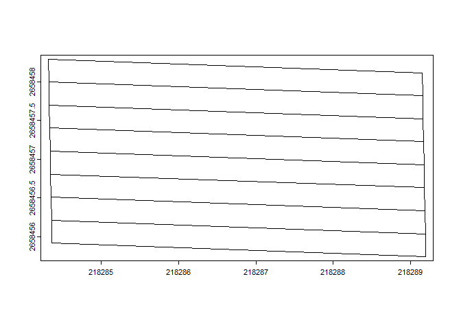

<!-- README.md is generated from README.Rmd. Please edit that file -->

# pliman 

<!-- badges: start -->

[](https://CRAN.R-project.org/package=pliman)
[](https://lifecycle.r-lib.org/articles/stages.html#stable)

[](https://r-pkg.org/pkg/pliman)
[](https://r-pkg.org/pkg/pliman)
[](https://r-pkg.org/pkg/pliman)
[](https://zenodo.org/doi/10.5281/zenodo.4757333)

<!-- badges: end -->

The pliman (**pl**ant **im**age **an**alysis) package is designed to
analyze plant images, particularly for leaf and seed analysis. It offers
a range of functionalities to assist with various tasks such as
measuring disease severity, counting lesions, obtaining lesion shapes,
counting objects in an image, extracting object characteristics,
performing Fourier Analysis, obtaining RGB values, extracting object
coordinates and outlines, isolating objects, and plotting object
measurements.

`pliman` also provides useful functions for image transformation,
binarization, segmentation, and resolution. Please visit the
[Examples](https://tiagoolivoto.github.io/pliman/reference/index.html)
page on the `pliman` website for detailed documentation of each
function.

# Installation

Install the latest stable version of `pliman` from
[CRAN](https://CRAN.R-project.org/package=pliman) with:

``` r
install.packages("pliman")
```

The development version of `pliman` can be installed from
[GitHub](https://github.com/TiagoOlivoto/pliman) with:

``` r
devtools::install_github("TiagoOlivoto/pliman")

# To build the HTML vignette use
devtools::install_github("TiagoOlivoto/pliman", build_vignettes = TRUE)
```

*Note*: If you are a Windows user, you should also first download and
install the latest version of
[Rtools](https://cran.r-project.org/bin/windows/Rtools/).

# Analyze objects

The function `analyze_objects()` can be used to analyze objects such as
leaves, grains, pods, and pollen in an image. By default, all measures
are returned in pixel units. Users can [adjust the object
measures](https://tiagoolivoto.github.io/pliman/articles/analyze_objects.html#adjusting-object-measures)
with `get_measures()` provided that the image resolution (Dots Per Inch)
is known. Another option is to use a reference object in the image. In
this last case, the argument `reference` must be set to `TRUE`. There
are two options to identify the reference object:

1.  By its color, using the arguments `back_fore_index` and
    `fore_ref_index`  
2.  By its size, using the arguments `reference_larger` or
    `reference_smaller`

In both cases, the `reference_area` must be declared. Let’s see how to
analyze an image with flax grains containing a reference object
(rectangle with 2x3 cm). Here, we’ll identify the reference object by
its size; so, the final results in this case will be in metric units
(cm).

``` r
library(pliman)
img <- image_pliman("flax_grains.jpg")
flax <- 
  analyze_objects(img,
                  index = "GRAY",
                  reference = TRUE,
                  reference_larger = TRUE,
                  reference_area = 6,
                  marker = "point",
                  marker_size = 0.5,
                  marker_col = "red", # default is white
                  show_contour = FALSE) # default is TRUE
```


``` r
# summary statistics
flax$statistics
#        stat        value
# 1         n 2.680000e+02
# 2  min_area 3.606989e-02
# 3 mean_area 6.250403e-02
# 4  max_area 1.262446e-01
# 5   sd_area 8.047152e-03
# 6  sum_area 1.675108e+01
# 7  coverage 5.388462e-02

# plot the density of the grain's length (in cm)
plot(flax, measure = "length")
```


# Analyzing orthomosaics

## Counting and measuring distance betwen plants

### Building the plots

In this example, an RGB orthomosaic from a rice field originally
available [here](https://github.com/aipal-nchu/RiceSeedlingDataset) is
used to show how `mosaic_analyze()` can be used to count plants and
measure the distance between plants within each plot. The first step is
to build the plots. By default a grid (`grid = TRUE`) is build according
to the `nrow` and `ncol` arguments. In this step, use the “Drawn
polygon” button to drawn a polygon that defines the area to be analyzed.
After drawing the polygon, click “Done”.

``` r
library(pliman)
url <- "https://github.com/TiagoOlivoto/images/raw/master/pliman/rice_field/rice_ex.tif"
mosaic <- mosaic_input(url)

res <- 
  mosaic_analyze(mosaic,
                 r = 1, g = 2, b = 3,
                 segment_individuals = TRUE,
                 segment_index = "(G-B)/(G+B-R)",
                 filter = 4,
                 nrow = 8,
                 map_individuals = TRUE)
```


When the argument `check_shapefile = TRUE` (default) is used, users can
check if the plots were correctly drawn. In this step, it is also
possible to a live edition of the plots by clicking on “edit layers”
button. After the changes are made, don’t forget to click “Save”. To
remove any plot, just click on “Delete layers” button, followed by
“Save”. After all the editions are made, click “Done”. The function will
follow the mosaic analysis using the edited shapefile.


After the mosaic has been analyzed, a plot is produced by default. In
this plot, individuals are highlighted with a color scale showing the
area of each individual. The results on both plot- and individual level
are stored in data frames that can be easily exported for further
analysis

``` r
res$map_indiv
```


### Using an external shapefile

When shapefile is provided there is no need to build the plots, since
the function will analyze the mosaic assuming the geometries provided by
the shapefile.

``` r
library(pliman)
# Import the mosaic
url <- "https://github.com/TiagoOlivoto/images/raw/master/pliman/rice_field/rice_ex.tif"
mosaic <- mosaic_input(url)
# class       : SpatRaster 
# dimensions  : 1443, 4914, 4  (nrow, ncol, nlyr)
# resolution  : 0.005115345, 0.005105305  (x, y)
# extent      : 218283.8, 218308.9, 2658452, 2658459  (xmin, xmax, ymin, ymax)
# coord. ref. : TWD97 / TM2 zone 121 (EPSG:3826) 
# source      : rice_ex.tif 
# names       : rice2_1, rice2_2, rice2_3, rice2_4 
# min values  :       0,       0,       0,     NaN 
# max values  :     254,     254,     254,     NaN

# Import the shapefile
url_shp <- "https://github.com/TiagoOlivoto/images/raw/master/pliman/rice_field/rice_ex_shp.shp"
shapefile <- shapefile_input(url_shp)
#  class       : SpatVector 
#  geometry    : polygons 
#  dimensions  : 8, 1  (geometries, attributes)
#  extent      : 218284.3, 218289.2, 2658456, 2658458  (xmin, xmax, ymin, ymax)
#  source      : rice_ex_shp.shp
#  coord. ref. : TWD97 / TM2 zone 121 (EPSG:3826) 
#  names       :   FID
#  type        : <int>
#  values      :     0
#                    1
#                    2
shapefile_plot(shapefile)
```



``` r

# analyze the mosaic using the shapefile
res <- 
  mosaic_analyze(mosaic,
                 r = 1, g = 2, b = 3,
                 shapefile = shapefile,
                 segment_individuals = TRUE,
                 segment_index = "(G-B)/(G+B-R)",
                 filter = 4,
                 map_individuals = TRUE)
#  
# Building the mosaic...
#  
# Computing the indexes...
# Index '(G-B)/(G+B-R)' is not available. Trying to compute your own index.
#  
# Extracting data from block 1 
#  
# Preparing to plot...
#  Done!
# Distances between individuals within each plot
str(res$result_individ_map)
# List of 3
#  $ distances:List of 8
#   ..$ row1: num [1:22] 0.23 0.195 0.211 0.225 0.185 ...
#   ..$ row2: num [1:22] 0.218 0.192 0.214 0.235 0.212 ...
#   ..$ row3: num [1:20] 0.66 0.199 0.187 0.215 0.202 ...
#   ..$ row4: num [1:22] 0.21 0.207 0.226 0.211 0.186 ...
#   ..$ row5: num [1:22] 0.229 0.213 0.21 0.198 0.212 ...
#   ..$ row6: num [1:22] 0.25 0.231 0.191 0.194 0.203 ...
#   ..$ row7: num [1:22] 0.2 0.212 0.17 0.213 0.208 ...
#   ..$ row8: num [1:23] 0.195 0.225 0.2 0.172 0.228 ...
#  $ cvs      : Named num [1:8] 6.92 5.67 44.84 5.78 6.06 ...
#   ..- attr(*, "names")= chr [1:8] "row1" "row2" "row3" "row4" ...
#  $ means    : Named num [1:8] 0.208 0.209 0.229 0.209 0.209 ...
#   ..- attr(*, "names")= chr [1:8] "row1" "row2" "row3" "row4" ...

# plot-level results
str(res$result_plot_summ)
# sf [8 × 17] (S3: sf/tbl_df/tbl/data.frame)
#  $ block             : chr [1:8] "B01" "B01" "B01" "B01" ...
#  $ plot_id           : chr [1:8] "0001" "0002" "0003" "0004" ...
#  $ mean_distance     : Named num [1:8] 0.208 0.209 0.229 0.209 0.209 ...
#   ..- attr(*, "names")= chr [1:8] "row1" "row2" "row3" "row4" ...
#  $ cv                : Named num [1:8] 6.92 5.67 44.84 5.78 6.06 ...
#   ..- attr(*, "names")= chr [1:8] "row1" "row2" "row3" "row4" ...
#  $ n                 : int [1:8] 23 23 21 23 23 23 23 24
#  $ area              : num [1:8] 0.01079 0.01051 0.01109 0.01342 0.00998 ...
#  $ coverage          : num [1:8] 0.173 0.168 0.162 0.215 0.16 ...
#  $ perimeter         : num [1:8] 0.416 0.393 0.424 0.471 0.389 ...
#  $ length            : num [1:8] 0.141 0.13 0.141 0.154 0.13 ...
#  $ width             : num [1:8] 0.108 0.108 0.11 0.128 0.106 ...
#  $ diam_min          : num [1:8] 0.0423 0.0438 0.0397 0.0473 0.0425 ...
#  $ diam_mean         : num [1:8] 0.0585 0.0569 0.0587 0.0652 0.0562 ...
#  $ diam_max          : num [1:8] 0.0749 0.0696 0.0753 0.0828 0.0686 ...
#  $ mean.(G-B)/(G+B-R): num [1:8] 0.169 0.172 0.173 0.177 0.19 ...
#  $ area_sum          : num [1:8] 0.248 0.242 0.233 0.309 0.23 ...
#  $ plot_area         : Units: [m^2] num [1:8] 1.44 1.44 1.44 1.44 1.44 ...
#  $ geometry          :sfc_POLYGON of length 8; first list element: List of 1
#   ..$ : num [1:5, 1:2] 218284 218289 218289 218284 218284 ...
#   ..- attr(*, "class")= chr [1:3] "XY" "POLYGON" "sfg"
#  - attr(*, "sf_column")= chr "geometry"
#  - attr(*, "agr")= Factor w/ 3 levels "constant","aggregate",..: NA NA NA NA NA NA NA NA NA NA ...
#   ..- attr(*, "names")= chr [1:16] "block" "plot_id" "mean_distance" "cv" ...

# individua-level results
str(res$result_indiv)
# Classes 'sf' and 'data.frame':    183 obs. of  14 variables:
#  $ block             : chr  "B01" "B01" "B01" "B01" ...
#  $ plot_id           : chr  "0001" "0001" "0001" "0001" ...
#  $ individual        : chr  "35" "45" "57" "63" ...
#  $ x                 : num  218288 218289 218288 218286 218285 ...
#  $ y                 : num  2658458 2658458 2658458 2658458 2658458 ...
#  $ area              : num  0.0193 0.0148 0.0167 0.0147 0.0171 ...
#  $ perimeter         : num  0.695 0.48 0.532 0.463 0.535 ...
#  $ length            : num  0.227 0.165 0.176 0.157 0.162 ...
#  $ width             : num  0.151 0.126 0.132 0.122 0.153 ...
#  $ diam_min          : num  0.0541 0.0558 0.0559 0.0548 0.0529 ...
#  $ diam_mean         : num  0.0822 0.0698 0.074 0.0685 0.0739 ...
#  $ diam_max          : num  0.1145 0.0899 0.0905 0.0802 0.0949 ...
#  $ mean..G.B...G.B.R.: num  0.224 0.177 0.157 0.194 0.146 ...
#  $ geometry          :sfc_POLYGON of length 183; first list element: List of 1
#   ..$ : num [1:114, 1:2] 218288 218288 218288 218288 218288 ...
#   ..- attr(*, "class")= chr [1:3] "XY" "POLYGON" "sfg"
#  - attr(*, "sf_column")= chr "geometry"
#  - attr(*, "agr")= Factor w/ 3 levels "constant","aggregate",..: NA NA NA NA NA NA NA NA NA NA ...
#   ..- attr(*, "names")= chr [1:13] "block" "plot_id" "individual" "x" ...
```

## Canopy coverage and multispectral indexes

In this example, a multispectral orthomosaic originally available
[here](https://github.com/diegojgris/draw-plots-qgis/blob/main/sampledata/MicaSenseMXRed_5bands.tif)
is used to show how `mosaic_analyze()` can be used to compute the plot
coverage and statistics such as min, mean, and max values of three
multispectral indexes (NDVI, EVI, and NDRE) using a design that includes
6 rows and 15 plots per row. Note how two plots were removed during the
live editing step.

``` r
library(pliman)
url <- "https://github.com/TiagoOlivoto/images/raw/master/pliman/NDSU/ndsu.tif"
mosaic <- mosaic_input(url)

url_shp <- "https://github.com/TiagoOlivoto/images/raw/master/pliman/NDSU/ndsu_shp.shp"
shapefile <- shapefile_input(url_shp)

res <- 
  mosaic_analyze(mosaic,
                 shapefile = shapefile,
                 # the following arguments can be ignored when a shapefile is provided
                 # nrow = 3,  # use 6 if you want to analyze in a single block
                 # ncol = 15,
                 # buffer_row = -0.15,
                 # buffer_col = -0.05,
                 segment_plot = TRUE,
                 segment_index = "NDVI", 
                 plot_index = c("NDVI", "EVI", "NDRE"), 
                 summarize_fun = c("min", "mean", "max"),
                 attribute = "coverage")
res$map_plot
```


See how this plot was produced in [this
video](https://www.linkedin.com/feed/update/urn:li:activity:7130585323574607872/)

# Disease severity

## Using image indexes

To compute the percentage of symptomatic leaf area you can use the
`measure_disease()` function you can use an image index to segment the
entire leaf from the background and then separate the diseased tissue
from the healthy tissue. Alternatively, you can provide color palette
samples to the `measure_disease()` function. In this approach, the
function fits a general linear model (binomial family) to the RGB values
of the image. It then uses the color palette samples to segment the
lesions from the healthy leaf.

In the following example, we compute the symptomatic area of a soybean
leaf. The proportion of healthy and symptomatic areas is given as a
proportion of the total leaf area after segmenting the leaf from the
background (blue).

``` r
img <- image_pliman("sev_leaf.jpg")
# Computes the symptomatic area
sev <- 
measure_disease(img = img,
                index_lb = "B", # to remove the background
                index_dh = "NGRDI", # to isolate the diseased area
                threshold = c("Otsu", 0), # You can also use the Otsu algorithm in both indexes (default)
                plot = TRUE)
```


``` r
sev$severity
#    healthy symptomatic
# 1 92.62721    7.372791
```

## Interactive disease measurements

An alternative approach to measuring disease percentage is available
through the `measure_disease_iter()` function. This function offers an
interactive interface that empowers users to manually select sample
colors directly from the image. By doing so, it provides a highly
customizable analysis method.

One advantage of using `measure_disease_iter()` is the ability to
utilize the “mapview” viewer, which enhances the analysis process by
offering zoom-in options. This feature allows users to closely examine
specific areas of the image, enabling detailed inspection and accurate
disease measurement.

``` r
img <- image_pliman("sev_leaf.jpg", plot = TRUE)

# works only in an interactive section
measure_disease_iter(img, viewer = "mapview")
```

# Citation

``` r
citation("pliman")
Please, support this project by citing it in your publications!

  Olivoto T (2022). "Lights, camera, pliman! An R package for plant
  image analysis." _Methods in Ecology and Evolution_, *13*(4),
  789-798. doi:10.1111/2041-210X.13803
  <https://doi.org/10.1111/2041-210X.13803>.

Uma entrada BibTeX para usuários(as) de LaTeX é

  @Article{,
    title = {Lights, camera, pliman! An R package for plant image analysis},
    author = {Tiago Olivoto},
    year = {2022},
    journal = {Methods in Ecology and Evolution},
    volume = {13},
    number = {4},
    pages = {789-798},
    doi = {10.1111/2041-210X.13803},
  }
```

# Getting help

If you come across any clear bugs while using the package, please
consider filing a minimal reproducible example on
[github](https://github.com/TiagoOlivoto/pliman/issues). This will help
the developers address the issue promptly.

Suggestions and criticisms aimed at improving the quality and usability
of the package are highly encouraged. Your feedback is valuable in
making {pliman} even better!

# Code of Conduct

Please note that the pliman project is released with a [Contributor Code
of Conduct](https://tiagoolivoto.github.io/pliman/CODE_OF_CONDUCT.html).
By contributing to this project, you agree to abide by its terms.

<div align="center">

<a href='https://www.free-website-hit-counter.com'></a><br/><small><a href='https://www.free-website-hit-counter.com' title="Free Website Hit Counter">Free
website hit counter</a></small>

</div>
