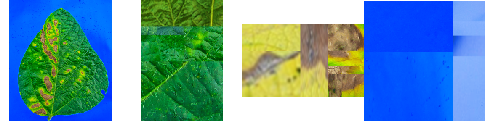
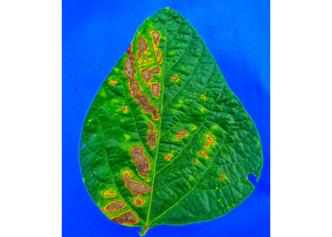
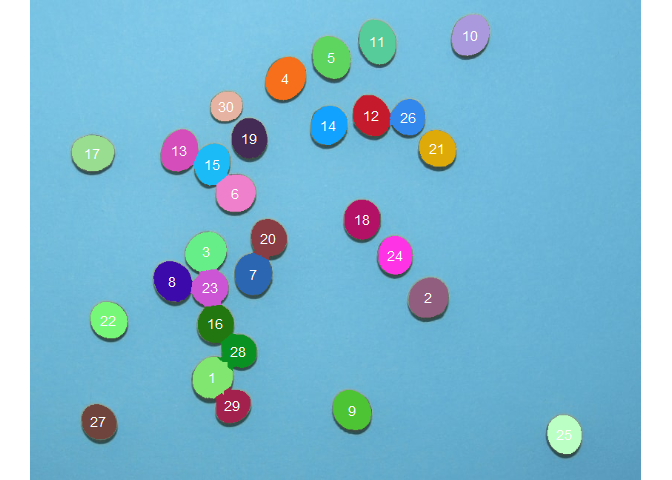
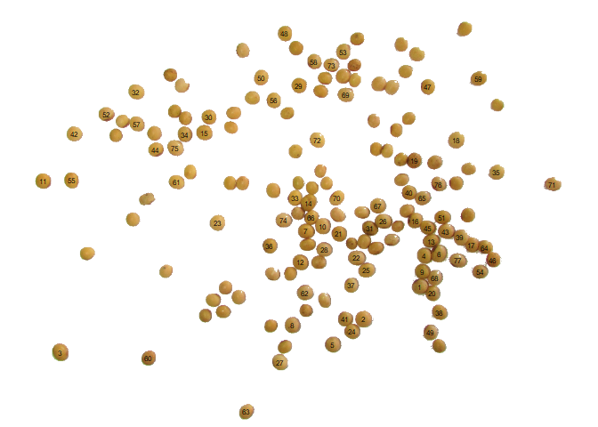

<!-- README.md is generated from README.Rmd. Please edit that file -->

# pliman 

<!-- badges: start -->
<!-- [](https://CRAN.R-project.org/package=metan) [](https://www.tidyverse.org/lifecycle/#stable)   [](https://zenodo.org/badge/latestdoi/130062661) -->
<!-- badges: end -->

`pliman` (**pl**ant **im**age **an**anlysis) is designed to analyze
plant images, especially related to leaf analysis. You provide color
palettes, tell `pliman` what each one represents, and it takes care of
the details. The package will help you to:

-   Measure leaf area
-   Measure disease severity
-   Count the number of lesions

# Installation

The development version of `pliman` can be installed from
[GitHub](https://github.com/TiagoOlivoto/pliman) with:

``` r
devtools::install_github("TiagoOlivoto/pliman")

# To build the HTML vignette use
devtools::install_github("TiagoOlivoto/pliman", build_vignettes = TRUE)
```

*Note*: If you are a Windows user, you should also first download and
install the latest version of
[Rtools](https://cran.r-project.org/bin/windows/Rtools/).

# Usage

# Disease severity

``` r
library(pliman)
# |===========================================|
# | Tools for Plant Image Analysis (pliman)   |
# | Author: Tiago Olivoto                     |
# |===========================================|
img <- image_import(system.file("tmp_images/sev2.png", package = "pliman"))
healthy <- image_import(system.file("tmp_images/sev_healthy.png", package = "pliman"))
symptoms <- image_import(system.file("tmp_images/sev_sympt.png", package = "pliman"))
background <- image_import(system.file("tmp_images/sev_back.png", package = "pliman"))
image_combine(img, healthy, symptoms, background, ncol = 4)
```

<!-- -->

``` r
symptomatic_area(img = img,
                 img_healthy = healthy,
                 img_symptoms = symptoms,
                 img_background = background,
                 show_image = TRUE)
```

<!-- -->

    #    healthy symptomatic
    # 1 88.38373    11.61627

# Count crop grains

The function `count_objects()` can be used to count the grains of an
image. In the following example, we will count the number of soybean
grains of an image with 150 grains.

``` r
img <- image_import(system.file("tmp_images/soy_150.png", package = "pliman"))
image_show(img)
```

<!-- -->

``` r
count_objects(img)
```

<!-- -->

    # 
    # --------------------------------------------
    # Number of objects: 150 
    # --------------------------------------------
    #  statistics        area   perimeter
    #         min   431.00000    69.00000
    #        mean   611.92000    80.60667
    #         max   844.00000    98.00000
    #          sd    86.50441     7.09182
    #         sum 91788.00000 12091.00000

In the following example, we will enumerate the grains with an area
greater than the mean of all grains in the image and add a white
background to the processed image.

``` r
count_objects(img,
              show_segmentation = FALSE,
              col_background = "white",
              marker = "text",
              lower_size = 611.92,
              marker_size = 0.5,
              marker_col = "black")
```

<!-- -->

    # 
    # --------------------------------------------
    # Number of objects: 77 
    # --------------------------------------------
    #  statistics        area perimeter
    #         min   613.00000   78.0000
    #        mean   682.18182   85.5974
    #         max   844.00000   98.0000
    #          sd    50.19009    5.3219
    #         sum 52528.00000 6591.0000

# Getting help

-   If you encounter a clear bug, please file a minimal reproducible
    example on [github](https://github.com/TiagoOlivoto/pliman/issues)

-   Suggestions and criticisms to improve the quality and usability of
    the package are welcome!
