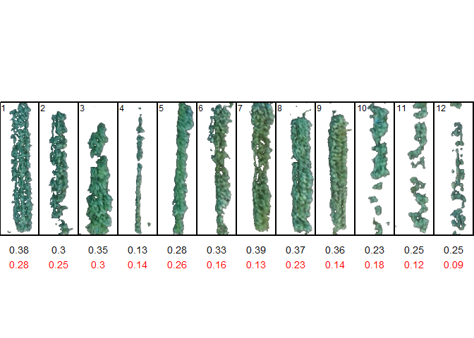

<!-- README.md is generated from README.Rmd. Please edit that file -->

# pliman 

<!-- badges: start -->

[](https://CRAN.R-project.org/package=pliman)
[](https://lifecycle.r-lib.org/articles/stages.html#experimental-1)

[](https://r-pkg.org/pkg/pliman)
[](https://r-pkg.org/pkg/pliman)
[](https://r-pkg.org/pkg/pliman)
[](https://zenodo.org/badge/latestdoi/352844585)

<!-- badges: end -->

The pliman (**pl**ant **im**age **an**alysis) package is designed to
analyze plant images, particularly for leaf and seed analysis. It offers
a range of functionalities to assist with various tasks such as
measuring disease severity, counting lesions, obtaining lesion shapes,
counting objects in an image, extracting object characteristics,
performing Fourier Analysis, obtaining RGB values, extracting object
coordinates and outlines, isolating objects, and plotting object
measurements.

`pliman` also provides useful functions for image
[transformation](https://tiagoolivoto.github.io/pliman/reference/utils_transform.html),
[binarization](https://tiagoolivoto.github.io/pliman/reference/image_binary.html),
[segmentation](https://tiagoolivoto.github.io/pliman/reference/image_segment.html),
and
[resolution](https://tiagoolivoto.github.io/pliman/reference/utils_dpi.html).
Please, visit the
[Examples](https://tiagoolivoto.github.io/pliman/index.html) page in
`pliman` website for a detailed documentation of each function.

# Installation

Install the latest stable version of `pliman` from
[CRAN](https://CRAN.R-project.org/package=pliman) with:

``` r
install.packages("pliman")
```

The development version of `pliman` can be installed from
[GitHub](https://github.com/TiagoOlivoto/pliman) with:

``` r
devtools::install_github("TiagoOlivoto/pliman")

# To build the HTML vignette use
devtools::install_github("TiagoOlivoto/pliman", build_vignettes = TRUE)
```

*Note*: If you are a Windows user, you should also first download and
install the latest version of
[Rtools](https://cran.r-project.org/bin/windows/Rtools/).

# Basic usage

## Analyze objects

The function `analyze_objects()` can be used to analyze objects such as
leaves, grains, pods, and pollen in an image. The following example
counts and computes several features of soybean grains of an image with
30 grains.

``` r
library(pliman)
# |==========================================================|
# | Tools for Plant Image Analysis (pliman 1.2.0.9000)            |
# | Author: Tiago Olivoto                                    |
# | Type 'citation('pliman')' to know how to cite pliman     |
# | Type 'vignette('pliman_start')' for a short tutorial     |
# | Visit 'http://bit.ly/pkg_pliman' for a complete tutorial |
# |==========================================================|
img <-image_pliman("soybean_touch.jpg", plot = TRUE)
```

<!-- -->

``` r
soy <- analyze_objects(img, marker = "id")
str(soy$results)
# 'data.frame': 30 obs. of  34 variables:
#  $ id                  : num  1 2 3 4 5 6 7 8 9 10 ...
#  $ x                   : num  245 537 237 344 277 ...
#  $ y                   : num  509 401 339 105 260 ...
#  $ area                : num  2279 2289 2310 2436 2159 ...
#  $ area_ch             : num  2304 2262 2288 2408 2122 ...
#  $ perimeter           : num  184 178 181 186 172 ...
#  $ radius_mean         : num  26.5 26.6 26.7 27.5 25.8 ...
#  $ radius_min          : num  23 24.8 24 24.3 24.2 ...
#  $ radius_max          : num  29.4 28.7 29.4 30.5 28 ...
#  $ radius_sd           : num  1.375 0.966 1.238 1.74 0.801 ...
#  $ diam_mean           : num  53 53.1 53.4 54.9 51.5 ...
#  $ diam_min            : num  45.9 49.7 48 48.6 48.5 ...
#  $ diam_max            : num  58.8 57.4 58.9 61.1 56.1 ...
#  $ major_axis          : num  19.3 19.5 19.8 20.8 18.7 ...
#  $ minor_axis          : num  18.2 18 17.9 18 17.7 ...
#  $ caliper             : num  57.3 56.9 57.7 61 54.4 ...
#  $ length              : num  56.6 56.5 57.2 61 54 ...
#  $ width               : num  51.5 52.4 52 51 50.5 ...
#  $ radius_ratio        : num  1.28 1.16 1.23 1.26 1.16 ...
#  $ theta               : num  -0.828 -0.804 -0.637 -0.979 -0.217 ...
#  $ eccentricity        : num  0.328 0.387 0.428 0.495 0.325 ...
#  $ form_factor         : num  0.85 0.906 0.886 0.889 0.92 ...
#  $ narrow_factor       : num  1.01 1.01 1.01 1 1.01 ...
#  $ asp_ratio           : num  1.1 1.08 1.1 1.2 1.07 ...
#  $ rectangularity      : num  1.28 1.29 1.29 1.28 1.26 ...
#  $ pd_ratio            : num  3.2 3.13 3.14 3.04 3.16 ...
#  $ plw_ratio           : num  1.7 1.64 1.66 1.66 1.64 ...
#  $ solidity            : num  0.989 1.012 1.009 1.012 1.017 ...
#  $ convexity           : num  0.887 0.879 0.911 0.919 0.898 ...
#  $ elongation          : num  0.089 0.0737 0.0911 0.1639 0.0643 ...
#  $ circularity         : num  14.8 13.9 14.2 14.1 13.7 ...
#  $ circularity_haralick: num  19.3 27.5 21.6 15.8 32.2 ...
#  $ circularity_norm    : num  0.821 0.875 0.855 0.858 0.887 ...
#  $ coverage            : num  0.00426 0.00428 0.00432 0.00456 0.00404 ...
```

# Disease severity

## Using image indexes

To compute the percentage of symptomatic leaf area you can use the
`measure_disease()` function you can use an image index to segment the
entire leaf from the background and then separate the diseased tissue
from the healthy tissue. Alternatively, you can provide color palette
samples to the `measure_disease()` function. In this approach, the
function fits a general linear model (binomial family) to the RGB values
of the image. It then uses the color palette samples to segment the
lesions from the healthy leaf.

In the following example, we compute the symptomatic area of a soybean
leaf. The proportion of healthy and symptomatic areas is given as a
proportion of the total leaf area after segmenting the leaf from the
background (blue).

``` r
img <- image_pliman("sev_leaf.jpg")
# Computes the symptomatic area
measure_disease(img = img,
                index_lb = "B", # to remove the background
                index_dh = "NGRDI", # to isolate the diseased area
                threshold = c("Otsu", 0), # You can also use the Otsu algorithm in both indexes (default)
                plot = TRUE)
```

<!-- -->

    # $severity
    #    healthy symptomatic
    # 1 92.62721    7.372791
    # 
    # $shape
    # NULL
    # 
    # $statistics
    # NULL
    # 
    # attr(,"class")
    # [1] "plm_disease"

## Interactive disease measurements

An alternative approach to measuring disease percentage is available
through the `measure_disease_iter()` function. This function offers an
interactive interface that empowers users to manually select sample
colors directly from the image. By doing so, it provides a highly
customizable analysis method.

One advantage of using `measure_disease_iter()` is the ability to
utilize the “mapview” viewer, which enhances the analysis process by
offering zoom-in options. This feature allows users to closely examine
specific areas of the image, enabling detailed inspection and accurate
disease measurement.

``` r
img <- image_pliman("sev_leaf.jpg", plot = TRUE)
measure_disease_iter(img, viewer = "mapview")
```

# Citation

``` r
citation("pliman")

Please, support this project by citing it in your publications!

  Olivoto T (2022). "Lights, camera, pliman! An R package for plant
  image analysis." _Methods in Ecology and Evolution_, *13*(4),
  789-798. doi:10.1111/2041-210X.13803
  <https://doi.org/10.1111/2041-210X.13803>.

A BibTeX entry for LaTeX users is

  @Article{,
    title = {Lights, camera, pliman! An R package for plant image analysis},
    author = {Tiago Olivoto},
    year = {2022},
    journal = {Methods in Ecology and Evolution},
    volume = {13},
    number = {4},
    pages = {789-798},
    doi = {10.1111/2041-210X.13803},
  }
```

# Getting help

If you come across any clear bugs while using the package, please
consider filing a minimal reproducible example on
[github](https://github.com/TiagoOlivoto/pliman/issues). This will help
the developers address the issue promptly.

Suggestions and criticisms aimed at improving the quality and usability
of the package are highly encouraged. Your feedback is valuable in
making {pliman} even better!

# Code of Conduct

Please note that the pliman project is released with a [Contributor Code
of Conduct](https://tiagoolivoto.github.io/pliman/CODE_OF_CONDUCT.html).
By contributing to this project, you agree to abide by its terms.

<div align="center">

<a href='https://www.free-website-hit-counter.com'></a><br/><small><a href='https://www.free-website-hit-counter.com' title="Free Website Hit Counter">Free
website hit counter</a></small>

</div>
