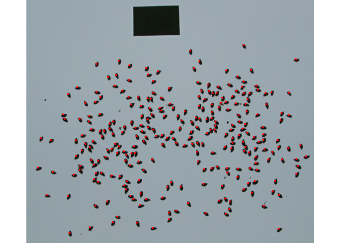

<!-- README.md is generated from README.Rmd. Please edit that file -->

# pliman 

<!-- badges: start -->

[](https://CRAN.R-project.org/package=pliman)
[](https://lifecycle.r-lib.org/articles/stages.html#experimental-1)
 
[](https://zenodo.org/badge/latestdoi/352844585)
<!-- badges: end -->

`pliman` (**pl**ant **im**age **an**alysis) is designed to analyze plant
images, especially related to leaf analysis. You provide color palettes,
tell `pliman` what each one represents, and it takes care of the
details. Image indexes can also be used to segment images. The package
will help you to:

-   Measure leaf area with `leaf_area()`
-   Measure disease severity with `symptomatic_area()`
-   Count the number of lesions with `count_lesions()`
-   Count objects in an image with `count_objects()`
-   Get the RGB values for each object in an image with `objects_rgb()`
-   Get object measures with `get_measures()`
-   Plot object measures with `plot_measures()`

`pliman` also provides useful functions for
[operation](https://tiagoolivoto.github.io/pliman/reference/image_combine.html),
[transformation](https://tiagoolivoto.github.io/pliman/reference/utils_transform.html),
and
[segmentation](https://tiagoolivoto.github.io/pliman/reference/image_binary.html)
of images. Please, visit the
[Examples](https://tiagoolivoto.github.io/pliman/index.html) page in
`pliman` website for a detailed documentation of each function.

# Installation

Install the latest stable version of `pliman` from
[CRAN](https://CRAN.R-project.org/package=pliman) with:

``` r
install.packages("pliman")
```

The development version of `pliman` can be installed from
[GitHub](https://github.com/TiagoOlivoto/pliman) with:

``` r
devtools::install_github("TiagoOlivoto/pliman")

# To build the HTML vignette use
devtools::install_github("TiagoOlivoto/pliman", build_vignettes = TRUE)
```

*Note*: If you are a Windows user, you should also first download and
install the latest version of
[Rtools](https://cran.r-project.org/bin/windows/Rtools/).

# Basic usage

# Disease severity

``` r
library(pliman)
# |========================================================|
# | Tools for Plant Image Analysis (pliman 0.3.0)          |
# | Author: Tiago Olivoto                                  |
# | Type 'vignette('pliman_start')' for a short tutorial   |
# | Visit 'https://bit.ly/3eL0dF3' for a complete tutorial |
# |========================================================|
img <- image_import(image_pliman("sev_leaf.jpg"))
healthy <- image_import(image_pliman("sev_healthy.jpg"))
symptoms <- image_import(image_pliman("sev_sympt.jpg"))
background <- image_import(image_pliman("sev_back.jpg"))
image_combine(img, healthy, symptoms, background, ncol = 4)
```

<!-- -->

``` r
symptomatic_area(img = img,
                 img_healthy = healthy,
                 img_symptoms = symptoms,
                 img_background = background,
                 show_image = TRUE)
```

<!-- -->

    #    healthy symptomatic
    # 1 89.04069    10.95931

# Count objects

The function `count_objects()` can be used to count the objects such as
leaves, grains, pods, pollen in an image. In the following example, we
will count the number of soybean grains of an image with 30 grains.

``` r
img <- image_import(image_pliman("soybean_touch.jpg"))
image_show(img)
```

<!-- -->

``` r
count_objects(img, marker = "text")
```

<!-- -->

    # 
    # --------------------------------------------
    # Number of objects: 30 
    # --------------------------------------------
    #  statistics       area   perimeter
    #         min  1366.0000  117.000000
    #        mean  2057.3667  146.600000
    #         max  2445.0000  158.000000
    #          sd   230.5574    8.406073
    #         sum 61721.0000 4398.000000

`pliman` takes the advantage of several powerful functions from [EBImage
package](https://bioconductor.org/packages/release/bioc/html/EBImage.html).
Thanks to Andrzej Oleś and collaborators for the impressive job done
with EBImage!

# Getting help

-   If you encounter a clear bug, please file a minimal reproducible
    example on [github](https://github.com/TiagoOlivoto/pliman/issues)

-   Suggestions and criticisms to improve the quality and usability of
    the package are welcome!

# Code of Conduct

Please note that the pliman project is released with a [Contributor Code
of Conduct](https://tiagoolivoto.github.io/pliman/CODE_OF_CONDUCT.html).
By contributing to this project, you agree to abide by its terms.
