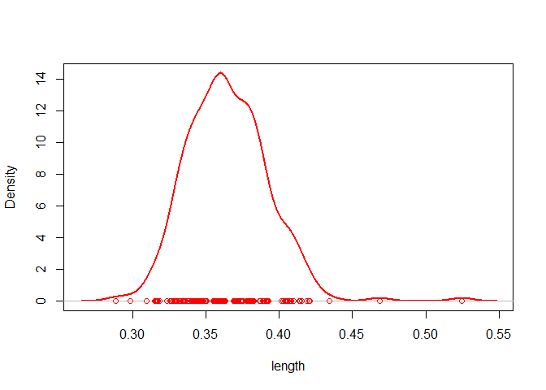

<!-- README.md is generated from README.Rmd. Please edit that file -->

# pliman 

<!-- badges: start -->

[](https://CRAN.R-project.org/package=pliman)
[](https://lifecycle.r-lib.org/articles/stages.html#stable)

[](https://r-pkg.org/pkg/pliman)
[](https://r-pkg.org/pkg/pliman)
[](https://r-pkg.org/pkg/pliman)
[](https://zenodo.org/doi/10.5281/zenodo.4757333)

<!-- badges: end -->

The pliman (**pl**ant **im**age **an**alysis) package is designed to
analyze plant images, particularly for leaf and seed analysis. It offers
a range of functionalities to assist with various tasks such as
measuring disease severity, counting lesions, obtaining lesion shapes,
counting objects in an image, extracting object characteristics,
performing Fourier Analysis, obtaining RGB values, extracting object
coordinates and outlines, isolating objects, and plotting object
measurements.

`pliman` also provides useful functions for image transformation,
binarization, segmentation, and resolution. Please visit the
[Examples](https://tiagoolivoto.github.io/pliman/reference/index.html)
page on the `pliman` website for detailed documentation of each
function.

# Installation

Install the latest stable version of `pliman` from
[CRAN](https://CRAN.R-project.org/package=pliman) with:

``` r
install.packages("pliman")
```

The development version of `pliman` can be installed from
[GitHub](https://github.com/TiagoOlivoto/pliman) using the
[pak](https://github.com/r-lib/pak) package:

``` r
pak::pkg_install("TiagoOlivoto/pliman")
```

*Note*: If you are a Windows user, you should also first download and
install the latest version of
[Rtools](https://cran.r-project.org/bin/windows/Rtools/).

# Analyze objects

The function `analyze_objects()` can be used to analyze objects such as
leaves, grains, pods, and pollen in an image. By default, all measures
are returned in pixel units. Users can [adjust the object
measures](https://tiagoolivoto.github.io/pliman/articles/analyze_objects.html#adjusting-object-measures)
with `get_measures()` provided that the image resolution (Dots Per Inch)
is known. Another option is to use a reference object in the image. In
this last case, the argument `reference` must be set to `TRUE`. There
are two options to identify the reference object:

1.  By its color, using the arguments `back_fore_index` and
    `fore_ref_index`  
2.  By its size, using the arguments `reference_larger` or
    `reference_smaller`

In both cases, the `reference_area` must be declared. Let’s see how to
analyze an image with flax grains containing a reference object
(rectangle with 2x3 cm). Here, we’ll identify the reference object by
its size; so, the final results in this case will be in metric units
(cm).

``` r
library(pliman)
img <- image_pliman("flax_grains.jpg")
flax <- 
  analyze_objects(img,
                  index = "GRAY",
                  reference = TRUE,
                  reference_larger = TRUE,
                  reference_area = 6,
                  marker = "point",
                  marker_size = 0.5,
                  marker_col = "red", # default is white
                  show_contour = FALSE) # default is TRUE
```


``` r
# summary statistics
flax$statistics
#        stat        value
# 1         n 2.680000e+02
# 2  min_area 3.606989e-02
# 3 mean_area 6.250403e-02
# 4  max_area 1.262446e-01
# 5   sd_area 8.047152e-03
# 6  sum_area 1.675108e+01
# 7  coverage 5.388462e-02

# plot the density of the grain's length (in cm)
plot(flax, measure = "length")
```



# Analyzing orthomosaics

## Counting and measuring plants within plots

Here, I used `mosaic_analyze()` to count, measure, and extract image
indexes at block, plot, and individual levels using an orthomosaic from
a lettuce trial available in [this
paper](https://journals.plos.org/plosone/article?id=10.1371/journal.pone.0274731).
By using `segment_individuals = TRUE`, a deeper analysis is performed at
individual levels, which enables counting and measuring the plants
within plots. To reproduce, download the [lettuce
mosaic](https://github.com/TiagoOlivoto/images/blob/master/pliman/lettuce/lettuce.tif?raw=true),
and follow the tutorial below.

``` r
library(pliman)
set_wd_here() # set the directory to the file location
mo <- mosaic_input("lettuce.tif")
indexes <- c("NGRDI", "GLI", "SCI", "BI", "VARI", "EXG", "MGVRI")
# draw four blocks of 12 plots
an <- mosaic_analyze(mo,
           r = 1, g = 2, b = 3,
           nrow = 12,
           segment_individuals = TRUE,
           segment_index = "NGRDI",
           plot_index = indexes)
```


## Canopy coverage and multispectral indexes

In this example, a multispectral orthomosaic originally available
[here](https://github.com/diegojgris/draw-plots-qgis/blob/main/sampledata/MicaSenseMXRed_5bands.tif)
is used to show how `mosaic_analyze()` can be used to compute the plot
coverage and statistics such as min, mean, and max values of three
multispectral indexes (NDVI, EVI, and NDRE) using a design that includes
6 rows and 15 plots per row. To reproduce, download the
[orthomosaic](https://github.com/TiagoOlivoto/images/raw/master/pliman/NDSU/ndsu.tif?raw=true),
save it within the current workind directory, and follow the tutorial
below.

``` r
library(pliman)
set_wd_here() # set the directory to the file location
mosaic <- mosaic_input("ndsu.tif")

res <- 
  mosaic_analyze(mosaic,
                 nrow = 3,  # use 6 if you want to analyze in a single block
                 ncol = 15,
                 buffer_row = -0.15,
                 buffer_col = -0.05,
                 segment_plot = TRUE,
                 segment_index = "NDVI", 
                 plot_index = c("NDVI", "EVI", "NDRE"), 
                 summarize_fun = c("min", "mean", "max"),
                 attribute = "coverage")
res$map_plot
```


## Counting and measuring distance betwen plants

In this example, an RGB orthomosaic from a rice field originally
available [here](https://github.com/aipal-nchu/RiceSeedlingDataset) is
used to show how `mosaic_analyze()` can be used to count plants and
measure the distance between plants within each plot. The first step is
to build the plots. By default a grid (`grid = TRUE`) is build according
to the `nrow` and `ncol` arguments. In this step, use the “Drawn
polygon” button to drawn a polygon that defines the area to be analyzed.
After drawing the polygon, click “Done”. When the argument
`check_shapefile = TRUE` (default) is used, users can check if the plots
were correctly drawn. In this step, it is also possible to a live
edition of the plots by clicking on “edit layers” button. After the
changes are made, don’t forget to click “Save”. To remove any plot, just
click on “Delete layers” button, followed by “Save”. After all the
editions are made, click “Done”. The function will follow the mosaic
analysis using the edited shapefile. After the mosaic has been analyzed,
a plot is produced by default. In this plot, individuals are highlighted
with a color scale showing the area of each individual. The results on
both plot- and individual level are stored in data frames that can be
easily exported for further analysis

To reproduce, download the [rice_ex.tif
mosaic](https://github.com/TiagoOlivoto/images/raw/master/pliman/rice_field/rice_ex.tif?raw=true),
save it within the current working directory, and follow the tutorial
below.

``` r
library(pliman)
set_wd_here() # set the directory to the file location
mosaic <- mosaic_input("rice_ex.tif")

res <- 
  mosaic_analyze(mosaic,
                 r = 1, g = 2, b = 3,
                 segment_individuals = TRUE,
                 segment_index = "(G-B)/(G+B-R)",
                 filter = 4,
                 nrow = 8,
                 map_individuals = TRUE)
```


### Using an external shapefile

When a shapefile is provided there is no need to build the plots, since
the function will analyze the mosaic assuming the geometries provided by
the shapefile. To reproduce, download the
[mosaic](https://github.com/TiagoOlivoto/images/raw/master/pliman/rice_field/rice_ex.tif?raw=true)
and
[shapefile](https://github.com/TiagoOlivoto/images/raw/master/pliman/rice_field/rice_ex_shp.rds?raw=true)
needed, save them within the current working directory and follow the
scripts below.

``` r
library(pliman)
set_wd_here() # set the directory to the file location
# Import the mosaic
mosaic <- mosaic_input("rice_ex.tif")
# Import the shapefile
shapefile <- shapefile_input("rice_ex_shp.rds")

# analyze the mosaic using the shapefile
res <- 
  mosaic_analyze(mosaic,
                 r = 1, g = 2, b = 3,
                 shapefile = shapefile,
                 segment_individuals = TRUE,
                 segment_index = "(G-B)/(G+B-R)",
                 filter = 4,
                 map_individuals = TRUE)
# Distances between individuals within each plot
str(res$result_individ_map)

# plot-level results
str(res$result_plot_summ)

# individua-level results
str(res$result_indiv)
```

# Disease severity

## Using image indexes

To compute the percentage of symptomatic leaf area you can use the
`measure_disease()` function you can use an image index to segment the
entire leaf from the background and then separate the diseased tissue
from the healthy tissue. Alternatively, you can provide color palette
samples to the `measure_disease()` function. In this approach, the
function fits a general linear model (binomial family) to the RGB values
of the image. It then uses the color palette samples to segment the
lesions from the healthy leaf.

In the following example, we compute the symptomatic area of a soybean
leaf. The proportion of healthy and symptomatic areas is given as a
proportion of the total leaf area after segmenting the leaf from the
background (blue).

``` r
img <- image_pliman("sev_leaf.jpg")
# Computes the symptomatic area
sev <- 
measure_disease(img = img,
                index_lb = "B", # to remove the background
                index_dh = "NGRDI", # to isolate the diseased area
                threshold = c("Otsu", 0), # You can also use the Otsu algorithm in both indexes (default)
                plot = TRUE)
```


``` r
sev$severity
#    healthy symptomatic
# 1 92.62721    7.372791
```

## Interactive disease measurements

An alternative approach to measuring disease percentage is available
through the `measure_disease_iter()` function. This function offers an
interactive interface that empowers users to manually select sample
colors directly from the image. By doing so, it provides a highly
customizable analysis method.

One advantage of using `measure_disease_iter()` is the ability to
utilize the “mapview” viewer, which enhances the analysis process by
offering zoom-in options. This feature allows users to closely examine
specific areas of the image, enabling detailed inspection and accurate
disease measurement.

``` r
img <- image_pliman("sev_leaf.jpg", plot = TRUE)

# works only in an interactive section
measure_disease_iter(img, viewer = "mapview")
```

# Citation

``` r
citation("pliman")
Please, support this project by citing it in your publications!

  Olivoto T (2022). "Lights, camera, pliman! An R package for plant
  image analysis." _Methods in Ecology and Evolution_, *13*(4),
  789-798. doi:10.1111/2041-210X.13803
  <https://doi.org/10.1111/2041-210X.13803>.

Uma entrada BibTeX para usuários(as) de LaTeX é

  @Article{,
    title = {Lights, camera, pliman! An R package for plant image analysis},
    author = {Tiago Olivoto},
    year = {2022},
    journal = {Methods in Ecology and Evolution},
    volume = {13},
    number = {4},
    pages = {789-798},
    doi = {10.1111/2041-210X.13803},
  }
```

# Getting help

If you come across any clear bugs while using the package, please
consider filing a minimal reproducible example on
[github](https://github.com/TiagoOlivoto/pliman/issues). This will help
the developers address the issue promptly.

Suggestions and criticisms aimed at improving the quality and usability
of the package are highly encouraged. Your feedback is valuable in
making {pliman} even better!

# Code of Conduct

Please note that the pliman project is released with a [Contributor Code
of Conduct](https://tiagoolivoto.github.io/pliman/CODE_OF_CONDUCT.html).
By contributing to this project, you agree to abide by its terms.
